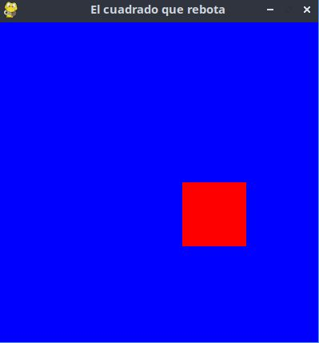

# Rage del Cuadrado XD

Este proyecto fue creado con Python y Pygame.  
Consiste en una cara estilo "rage" que puede moverse usando las teclas WASD.

---

# Requisitos

Antes de ejecutar el proyecto necesitas tener:

- Python 3 instalado
- Pygame instalado

Instalar pygame:

```bash
pip install pygame
```

---

# Cómo ejecutar el proyecto

1. Guarda el código en un archivo llamado:

```bash
main.py
```

2. Ejecuta el archivo:

```bash
python main.py
```

---

# Controles

| Tecla | Acción |
|---|---|
| W | Mover arriba |
| A | Mover izquierda |
| S | Mover abajo |
| D | Mover derecha |

---

# Cómo funciona el código

## 1. Inicialización de Pygame

```python
pygame.init()
```

Inicializa todos los módulos necesarios de Pygame.

---

## 2. Creación de la ventana

```python
pantalla = pygame.display.set_mode((800, 500))
```

Crea una ventana de 800x500 píxeles.

---

## 3. Clase del personaje

```python
class RAGE(pygame.sprite.Sprite):
```

La clase hereda de `Sprite`, lo que permite usar el sistema de sprites de Pygame.

---

## 4. Dibujar la cara

La cara se crea usando figuras:

- `circle()` → cabeza y ojos
- `rect()` → boca y ojos
- `line()` → cejas y dientes

Ejemplo:

```python
pygame.draw.circle(self.image, BLANCO, (50, 50), 50)
```

---

## 5. Movimiento

El movimiento se controla con:

```python
pygame.key.get_pressed()
```

Detecta si el jugador presiona:

- W
- A
- S
- D

Y mueve el sprite cambiando:

```python
self.rect.x
self.rect.y
```

---

## 6. Bucle principal

```python
while True:
```

El juego se ejecuta infinitamente hasta cerrar la ventana.

Dentro del bucle:

- Detecta eventos
- Actualiza sprites
- Dibuja en pantalla
- Actualiza gráficos

---

# Estructura del proyecto

```bash
proyecto/
│
├── main.py
└── README.md
```

---

# Tecnologías usadas

- Python
- Pygame

---
